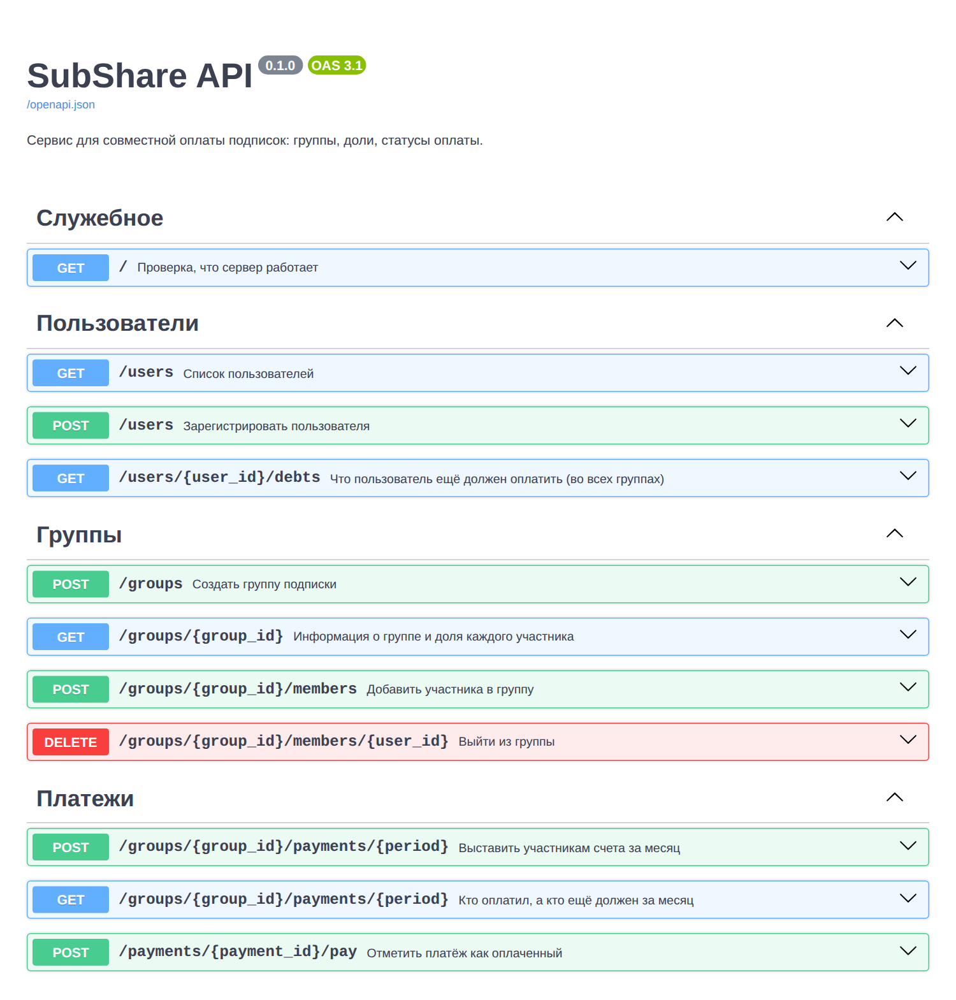
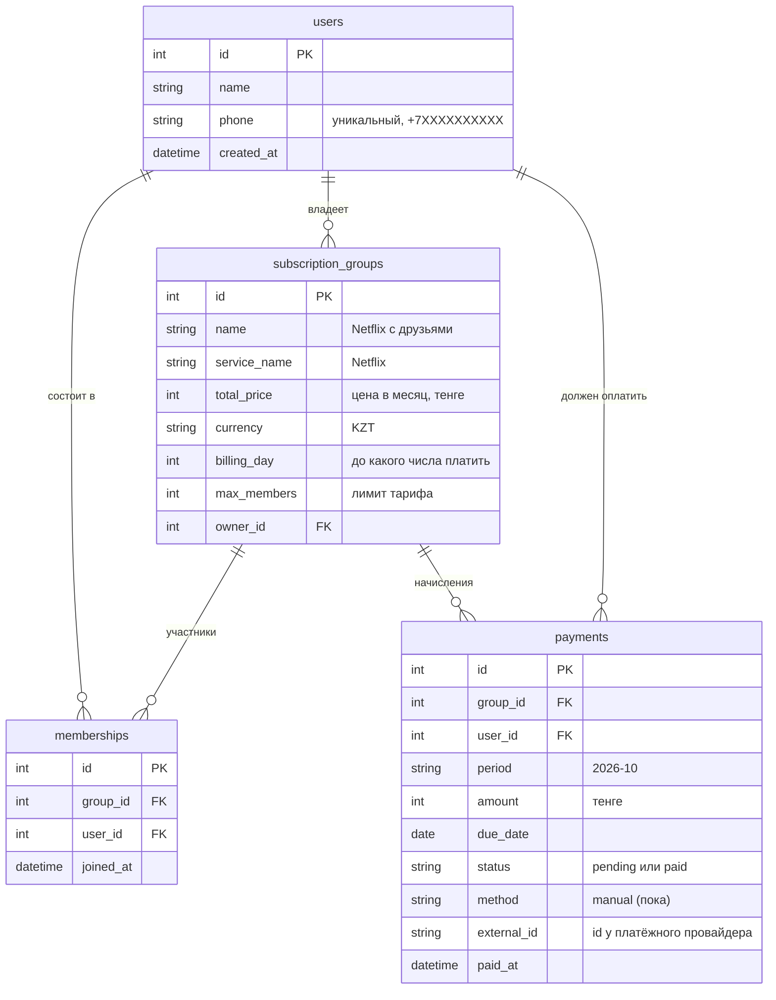

# SubShare — backend (серверная часть)

**SubShare** — сервис для совместной оплаты подписок. Пользователь создаёт группу
(например, «Netflix, 6000 ₸, 4 человека»), добавляет друзей, а SubShare сам считает
долю каждого и показывает, кто уже заплатил, а кто ещё должен.

Этот репозиторий — **серверная часть (API)** приложения. Мобильное приложение будет
отправлять запросы на этот сервер и показывать пользователю ответы.



---

## Что уже сделано

| Требование задания | Что реализовано |
|---|---|
| Выбрана технология | Python + FastAPI + SQLite + SQLAlchemy (почему именно они — ниже) |
| Создан проект / репозиторий | Структура проекта, зависимости, `.gitignore`, README, тесты |
| Подключение к базе данных | `app/database.py`: база SQLite, таблицы создаются автоматически при запуске |
| Структура моделей / таблиц | `app/models.py`: 4 таблицы — пользователи, группы, участники, платежи |
| Рабочие API-эндпоинты | `app/main.py`: 11 эндпоинтов (создание группы, расчёт долей, статусы оплаты и др.) |
| Проверка | 10 автоматических тестов (`pytest`) |

### Что умеет API

- регистрировать пользователей (имя + казахстанский номер `+7XXXXXXXXXX`);
- создавать группу подписки: сервис, цена, до какого числа платить, лимит участников;
- добавлять участников и выходить из группы (с проверкой лимита тарифа);
- **автоматически делить цену** на всех участников в целых тенге
  (6000 ₸ / 4 = 1500 ₸; 5000 ₸ / 3 = 1667 + 1667 + 1666 ₸);
- при выходе участника **пересчитывать доли** (6000 ₸ / 3 = 2000 ₸);
- выставлять счета участникам за месяц (владелец сам платит сервису, ему счёт не выставляется);
- показывать по группе за месяц: сколько собрать, сколько собрано, кто просрочил;
- показывать пользователю все его неоплаченные счета во всех группах;
- отмечать платёж как оплаченный.

---

## Почему выбраны именно эти технологии

| Технология | Что это | Почему подходит SubShare |
|---|---|---|
| **Python** | Язык программирования | Один из самых простых для новичков, много материалов на русском |
| **FastAPI** | Фреймворк для создания API | Мало кода; сам проверяет входящие данные; **автоматически создаёт страницу документации**, где любой эндпоинт можно проверить кнопкой в браузере |
| **SQLite** | База данных | Хранится в одном файле, ничего устанавливать не нужно. Для MVP достаточно |
| **SQLAlchemy** | Библиотека для работы с БД | Таблицы описываются как Python-классы. Переход на PostgreSQL — замена одной строки |
| **pytest** | Тесты | Автоматически проверяет, что расчёты и эндпоинты работают правильно |

**Мобильное приложение** (следующий этап) можно сделать на **Flutter** или **React Native** —
оба позволяют выпустить одно приложение сразу под Android и iOS. Приложение будет
обращаться к этому API.

### Про способ оплаты

Платёжная система ещё выбирается, поэтому в MVP деньги через SubShare не проходят:
участники переводят свою долю владельцу привычным способом (например, Kaspi),
а в SubShare платёж отмечается как оплаченный.

Подключение платёжной системы в структуре базы уже учтено: в таблице `payments`
есть поле `method` (сейчас всегда `manual` — ручной перевод) и поле `external_id`
для номера транзакции у провайдера. Когда будет выбран провайдер (Halyk ePay,
Freedom Pay или другой), таблицы переделывать не придётся — добавится новый
способ оплаты и код, который отмечает платёж оплаченным после ответа провайдера.

---

## Структура проекта

```
subshare-backend/
├── app/
│   ├── main.py        ← API-эндпоинты (адреса, к которым обращается приложение)
│   ├── models.py      ← таблицы базы данных
│   ├── schemas.py     ← формат данных в запросах и ответах + проверка ввода
│   ├── logic.py       ← расчёт долей и сроков оплаты
│   └── database.py    ← подключение к базе данных
├── tests/
│   └── test_api.py    ← автоматические тесты
├── docs/
│   └── swagger.png    ← скриншот документации API
├── seed.py            ← заполняет базу демо-данными
├── requirements.txt   ← список нужных библиотек
├── pytest.ini         ← настройки тестов
└── .gitignore         ← какие файлы не загружать в GitHub
```

## Схема базы данных



---

## Как запустить (пошагово)

### 1. Установите Python

Скачайте Python 3.10 или новее с [python.org](https://www.python.org/downloads/).
**На Windows** при установке обязательно поставьте галочку **«Add Python to PATH»**.

Проверка — откройте терминал (на Windows: «Командная строка» или PowerShell) и введите:

```bash
python --version
```

Должно появиться что-то вроде `Python 3.12.4`. (На macOS команда может называться `python3`.)

### 2. Откройте папку проекта в терминале

```bash
cd путь/к/папке/subshare-backend
```

Удобнее всего открыть папку в [VS Code](https://code.visualstudio.com/) и использовать
встроенный терминал (меню **Terminal → New Terminal**) — он сразу откроется в нужной папке.

### 3. Создайте виртуальное окружение и установите библиотеки

Виртуальное окружение — это отдельная «коробка» с библиотеками только для этого проекта.

**Windows:**
```bash
python -m venv venv
venv\Scripts\activate
pip install -r requirements.txt
```

**macOS / Linux:**
```bash
python3 -m venv venv
source venv/bin/activate
pip install -r requirements.txt
```

После активации в начале строки терминала появится `(venv)`.

> Если PowerShell пишет, что выполнение скриптов запрещено, выполните один раз
> `Set-ExecutionPolicy -Scope CurrentUser RemoteSigned` и повторите активацию.

### 4. (Необязательно) Заполните базу демо-данными

```bash
python seed.py
```

Создастся пример: группа «Netflix с друзьями», 6000 ₸ на 4 человека, счета за текущий месяц.

### 5. Запустите сервер

```bash
fastapi dev app/main.py
```

### 6. Откройте в браузере

- **http://127.0.0.1:8000/docs** — документация API, где можно нажимать и проверять эндпоинты;
- http://127.0.0.1:8000/groups/1 — информация о демо-группе.

Остановить сервер: `Ctrl + C` в терминале.

---

## Как проверить API в браузере (сценарий для демонстрации)

На странице **/docs** у каждого эндпоинта есть кнопка **Try it out** → **Execute**.

1. **POST /users** — создайте 4 пользователей (у каждого свой номер телефона).
2. **POST /groups** — создайте группу: `total_price: 6000`, `max_members: 4`, `owner_id: 1`.
3. **POST /groups/{group_id}/members** — добавьте пользователей 2, 3 и 4.
4. **GET /groups/{group_id}** — видно, что у каждого доля 1500 ₸.
5. **POST /groups/{group_id}/payments/{period}** — укажите `period` = `2026-10`:
   трём участникам выставлено по 1500 ₸.
6. **POST /payments/{payment_id}/pay** — отметьте одну оплату.
7. **GET /groups/{group_id}/payments/{period}** — собрано 1500 ₸, осталось 3000 ₸.
8. **DELETE /groups/{group_id}/members/{user_id}** — участник выходит, доли становятся по 2000 ₸.

## Как запустить тесты

```bash
pytest
```

Ожидаемый результат: `10 passed`.

---

## Как загрузить проект на GitHub

### Способ 1 — через GitHub Desktop (проще всего)

1. Зарегистрируйтесь на [github.com](https://github.com) и установите
   [GitHub Desktop](https://desktop.github.com/).
2. В GitHub Desktop: **File → Add local repository** → выберите папку `subshare-backend`.
3. Программа предложит **create a repository** — согласитесь.
4. Внизу слева напишите описание, например «Первая версия API SubShare», нажмите **Commit to main**.
5. Нажмите **Publish repository** (снимите галочку «Keep this code private»,
   если преподаватель должен видеть репозиторий без приглашения).

### Способ 2 — через терминал

Создайте на github.com пустой репозиторий `subshare-backend` (без README), затем:

```bash
git init
git add .
git commit -m "Первая версия API SubShare"
git branch -M main
git remote add origin https://github.com/ВАШ_ЛОГИН/subshare-backend.git
git push -u origin main
```

Папка `venv` и файл базы `subshare.db` в GitHub не попадут — они указаны в `.gitignore`.

---

## Что дальше

- **Авторизация** — вход по номеру телефона (SMS-код), чтобы каждый видел только свои группы
  и отмечать оплату мог только владелец группы. Сейчас API открыт — это учебный MVP.
- **Мобильное приложение** на Flutter или React Native, которое работает с этим API.
- **Напоминания** — push-уведомления или сообщения за 1–2 дня до срока оплаты и при просрочке.
- **Приглашения по ссылке** — чтобы добавить друга в группу одной ссылкой.
- **PostgreSQL и миграции (Alembic)** — когда появятся реальные пользователи.
- **Платёжная система** — после выбора провайдера и выяснения юридических условий: AutoPay,
  автоматическое удержание комиссии SubShare.
